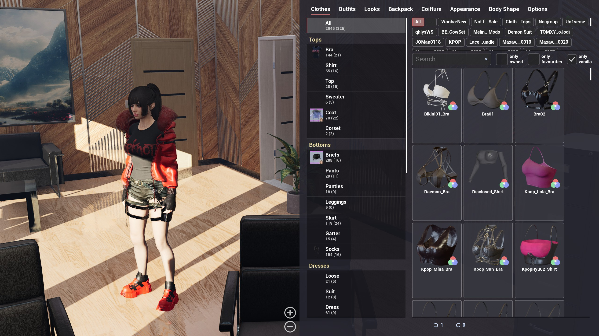
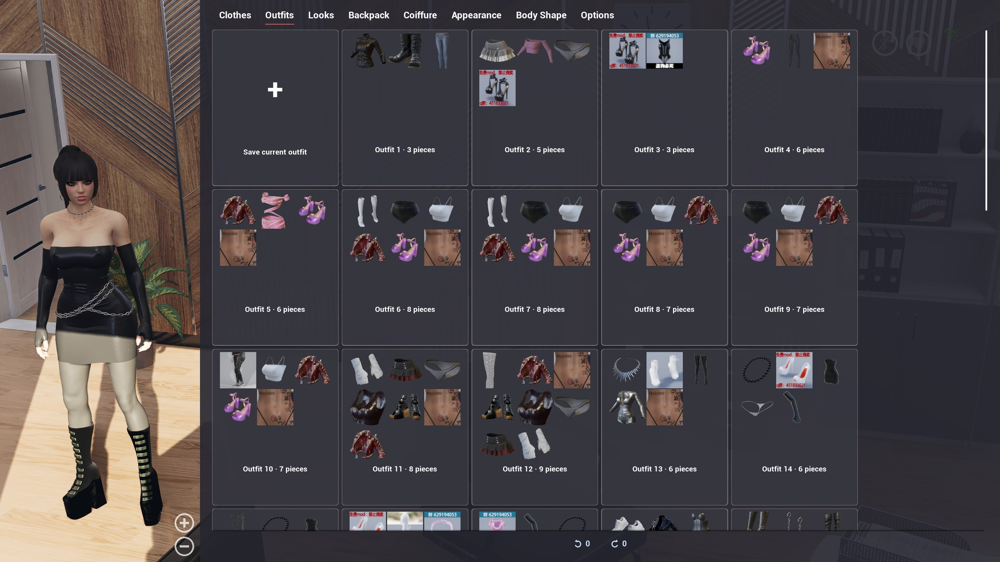
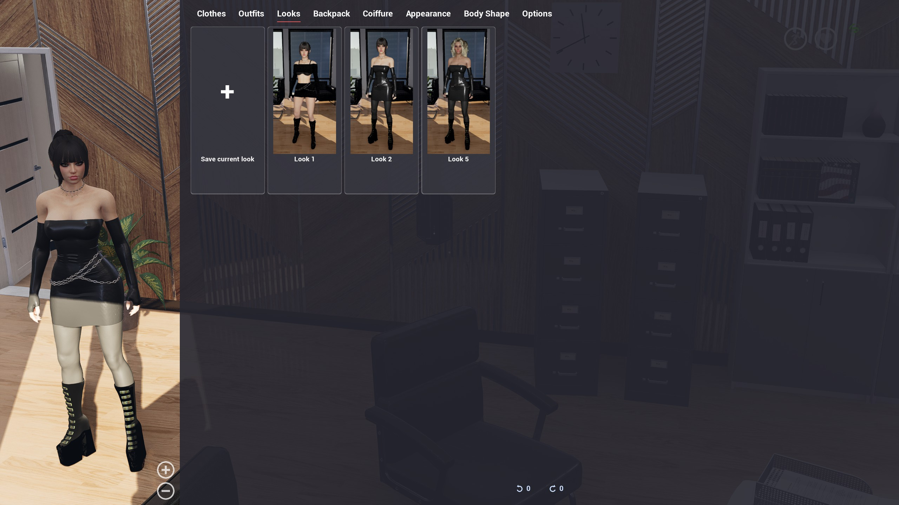
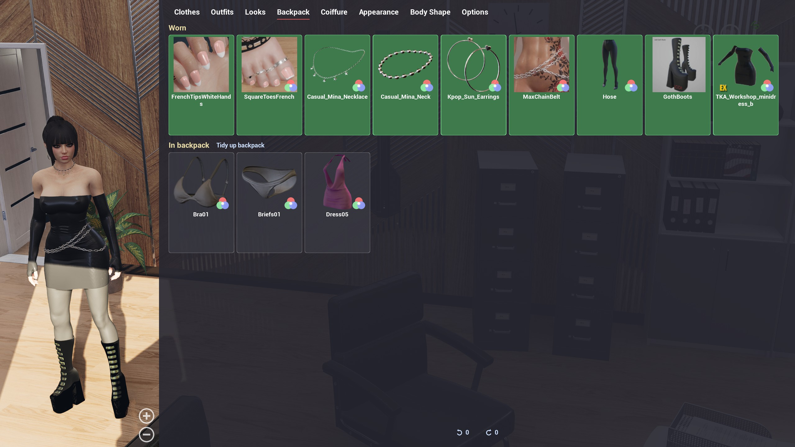
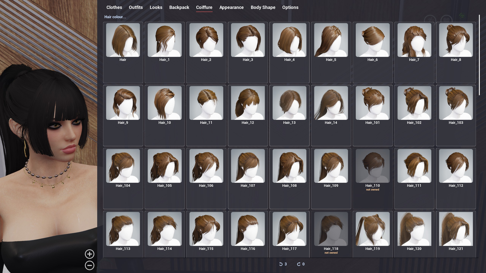
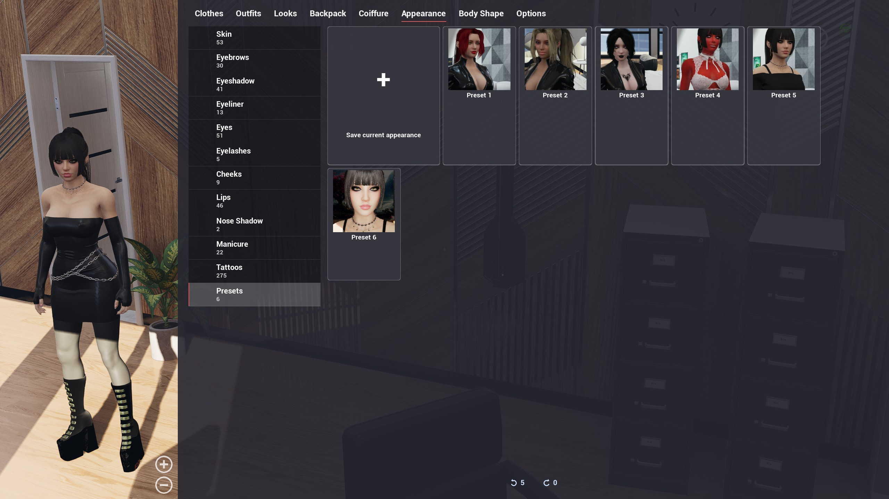
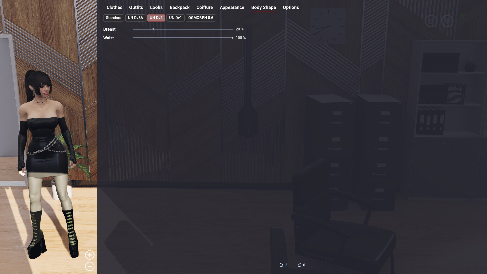
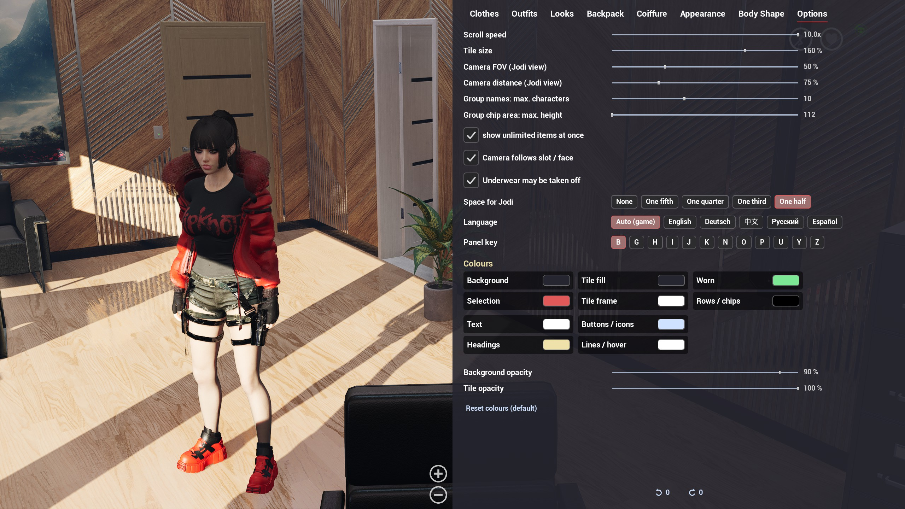
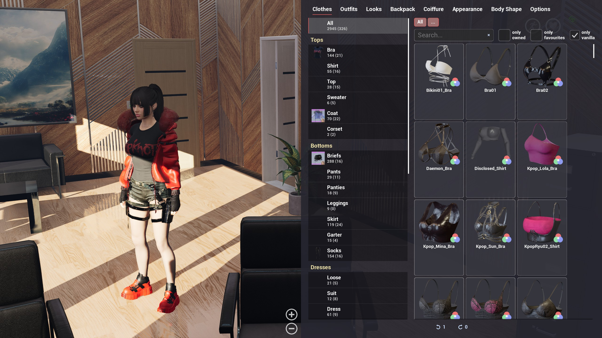

# AltUI

A replacement wardrobe and appearance UI for *The Killing Antidote* (game version 0.6.x). The vanilla wardrobe gives every mod author their own tab, so with a few clothing mods installed the same kind of item is scattered across a dozen tabs and there is no way to search. AltUI sorts every item from the game and from all installed mods into **one list per slot** (tops, skirts, shoes, …), with search, filters, favourites and hiding – and puts hair, makeup, body and outfits into the same panel. It opens anywhere in a level with **B**; no trips to the wardrobe or the mirror.

## Installation

Two files from the [latest release](../../releases) (also on [Nexus Mods](https://www.nexusmods.com/thekillingantidote/mods/988) and the [Steam Workshop](https://steamcommunity.com/sharedfiles/filedetails/?id=3802875867)), two folders (paths relative to the game installation, e.g. `Steam/steamapps/common/TheKillingAntidote/`):

| File | Copy to |
|---|---|
| `AltUI.pak` | `TheKillingAntidote/Mods/` |
| `AltUI_Hook_P.pak` | `TheKillingAntidote/Content/Paks/~mods/` (create the folder; the name starts with a tilde) |

Both are required. The hook replaces the game's `TKA_PlayerCameraManager` blueprint (it spawns the panel and moves the camera); without it **B does nothing**. It conflicts with any other mod that replaces the same blueprint (none known).

The hook rarely changes: it only spawns the panel and moves the camera, everything else is in `AltUI.pak`. A mod update therefore normally does not need a new hook file – each changelog entry says whether it does. A new hook is only needed when the changelog says so or when a game update replaces the player camera manager.

Uninstall: delete the two files. The mod's own saves may go too: `Saved/SaveGames/AltUI.sav`, `AltUI_Looks.sav` and the look photos in `Saved/SaveGames/AltUI/`. Nothing else is touched – clothes, outfits, makeup and hair are written through the game's own save files.

## What it does

| Tab | Content |
|---|---|
| **Clothes** | Every item the game and your mods know, grouped by slot, sub-tabs per mod (collapsible), search, "owned only" / "favourites only" / "vanilla only" filters, favourites, colour via the game's palette, colour reset, backpack in/out, hide items. |
| **Outfits** | The game's outfit presets, with names (right-click → rename). |
| **Looks** | A complete look – clothes with colours, hairstyle and colour, makeup, eyes, skin, body sliders, body mod – saved with an in-game full-body photo. Apply, update, rename, delete. |
| **Backpack** | What Jodi wears and carries: wear, remove, repair, back to wardrobe, clean up. |
| **Coiffure** | All hairstyles, hair colour, factory reset. |
| **Appearance** | Skin, every makeup type, eyes, appearance presets with icons. |
| **Body Shape** | Breast / waist sliders and a switcher for installed body mods (below). |
| **Options** | Panel key, language, scroll speed, tile size, length of group names and height of the group row, screen share kept free for Jodi, camera FOV / distance / pan, colour scheme and opacity, "underwear may be taken off". |

Undo / redo (5 steps) in the status bar; tooltips show which mod an item comes from. Languages: English, German, Chinese, Russian, Spanish (auto-detected, switchable).

**Controls:** **B** opens / closes (changeable in Options), **Esc** closes. Left click selects / wears / applies, right click opens the context menu, mouse wheel scrolls. While the panel is open Jodi cannot walk; drag on the background to turn the camera, +/− changes the distance.

## Body mods

Body replacer paks all overwrite the same game file, so only one can be active and nothing can switch between them. `bodypak.pyz` (in the release, Python 3.8+, no packages) converts a replacer into a regular mod pak that keeps the mesh under its own path; any number of converted bodies can be installed side by side and appear as chips in the Body Shape tab. The choice is remembered and re-applied on every level load. Step-by-step instructions with a Windows and a Linux walk-through: [BODY_MODS.md](BODY_MODS.md).

```
python3 bodypak.pyz <Original.pak> [--name Body_<Name>] [--title "Display name"] [--out <folder>] [--force]
python3 bodypak.pyz SomeBodyReplacer.pak --name Body_Some --title "Some body"
```

`--name` must match `Body_[A-Za-z0-9_]+` (default: derived from the file name); `--title` is the chip text. Copy the resulting `Body_<Name>.pak` to `TheKillingAntidote/Mods/` and remove the original replacer from `Mods/` or `~mods/` (or keep it in `~mods/` – it then becomes the "Standard" chip). The mesh is taken byte for byte, together with the assets it uses from the same pak – some bodies get their shape from their own animation blueprint (bone scaling) rather than from the mesh, and without it the converted body would look like the standard one. Skin textures and other files the mesh does not use are left out; the converter lists them. Pak versions 3–11, uncompressed / zlib / Oodle (Windows and Linux; the Oodle decoder [ooz](https://github.com/powzix/ooz), GPL-3, is bundled).

## Building from source

Everything in the paks is generated – no game assets are included.

### Requirements

* Unreal Engine 4.27 built from source.
* Python 3.
* The official sample project *TKA_Workshop* linked in the Steam guide [Workshop Mod Creation](https://steamcommunity.com/sharedfiles/filedetails/?id=3360997448) – it contains the game's class blueprints the mod compiles against.

### Build

* Copy `bpgen/` to `<sample project>/Plugins/TKA_BPGen` and build the project once. Copy `config.example.sh` to `config.sh` and set the paths.
* `./build.sh` – runs the generators (`assets/gen/*.py` → `assets/*.json`), the BPGen commandlet (adds the missing function stubs to the sample project's game classes and creates the widgets and the manager blueprint), cook, pak, verify, deploy (`--no-deploy` to skip).
* Tests: `python3 -m unittest discover -s tests/unit`, editor tests `scripts/edtest.sh $PWD/tests/editor/test_<name>.py`.
* `scripts/bodypak_dist.sh` builds `bodypak.pyz`. `tools/fetch_ooz.sh` fetches [ooz](https://github.com/powzix/ooz) (GPL-3, open-source Oodle decoder) and builds `libooz.so` and – with [zig](https://ziglang.org/) as cross-compiler (`pip install ziglang`) – `ooz.dll`; both go into `bodypak.pyz`, which needs them to read the mesh of Oodle-compressed body paks.

## Screenshots

| | |
|---|---|
| **Clothes** – one list per slot, group chips, search, filters  | **Outfits** – the game's presets with names  |
| **Looks** – complete looks with photo  | **Backpack** – worn and carried items  |
| **Coiffure** – hairstyles and hair colour  | **Appearance** – skin, makeup, eyes, presets  |
| **Body Shape** – sliders and body switcher  | **Options** – key, language, camera, colours  |
| **Clothes** with the group chips collapsed ("…")  | |

## License

MIT – see `LICENSE`. AltUI is a fan project and not affiliated with the game's developer.
